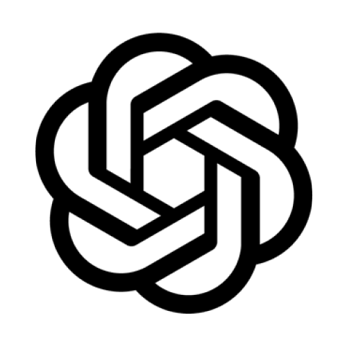

# AI Gateway

<div align="center">
    
</div>

## Overview

The **AI Gateway** is a high-performance, reliable, and scalable API gateway designed to streamline requests to over **250+ language, vision, audio, and image models** through a unified API. Engineered with cutting-edge technologies and optimized for minimal latency, the AI Gateway is production-ready and supports features like caching, fallbacks, retries, timeouts, and load balancing. It can be deployed at the edge, ensuring the fastest possible response times for your applications.

**Key Highlights:**

- **Blazing Fast Performance**: Up to **9.9x faster** with a tiny footprint (~100kb build).
- **Load Balancing**: Distribute requests across multiple models, providers, and API keys.
- **Resilience with Fallbacks**: Ensure high availability by seamlessly switching to backup models or providers.
- **Automatic Retries**: Built-in retry mechanisms with exponential backoff strategies.
- **Configurable Request Timeouts**: Handle unresponsive LLM requests efficiently.
- **Multimodal Support**: Route between vision, text-to-speech (TTS), speech-to-text (STT), image generation, and more.
- **Middleware Integration**: Plug-in custom middleware as needed.
- **Battle-Tested**: Proven reliability with over **480 billion tokens** processed.
- **Enterprise-Ready**: Enhanced security, scalability, and custom deployment options.

## Table of Contents

- [Architecture](#architecture)
- [Features](#features)
- [Setup & Installation](#setup--installation)
  - [Hosted Gateway on Portkey.ai](#hosted-gateway-on-portkeyai)
  - [Self-Hosting the Open-Source Version](#self-hosting-the-open-source-version)
  - [Self-Hosting the Enterprise Version](#self-hosting-the-enterprise-version)
- [Usage](#usage)
  - [Compatible with OpenAI API & SDKs](#compatible-with-openai-api--sdks)
  - [Using the Python SDK](#using-the-python-sdk)
  - [Using the Node.js SDK](#using-the-nodejs-sdk)
  - [Using the REST APIs](#using-the-rest-apis)
  - [Other Integrations](#other-integrations)
- [Gateway Cookbooks](#gateway-cookbooks)
- [Supported Providers](#supported-providers)
- [Agents Integration](#agents-integration)
- [Advanced Features](#advanced-features)
  - [Fallbacks](#fallbacks)
  - [Automatic Retries](#automatic-retries)
  - [Load Balancing](#load-balancing)
  - [Request Timeouts](#request-timeouts)
  - [Multi-Modal LLM Gateway](#multi-modal-llm-gateway)
  - [Guardrails](#guardrails)
  - [Configuring Features](#configuring-features)
- [Enterprise Version](#enterprise-version)
- [Contributing](#contributing)
- [Community](#community)
- [License](#license)
- [Support](#support)

## Architecture

The AI Gateway is designed as a scalable, distributed system that efficiently routes requests to various AI models and providers. It acts as a middleware layer between client applications and AI services, providing a unified API interface and advanced features like caching, retries, and load balancing.

**Core Components:**

- **Unified API Interface**: Simplifies integration by providing a consistent API format compatible with OpenAI.
- **Routing Engine**: Dynamically routes requests based on configurations, provider availability, and performance metrics.
- **Caching Layer**: Stores responses for identical or similar requests to reduce latency and costs.
- **Middleware Support**: Allows custom middleware for logging, authentication, and other pre/post-processing tasks.
- **Edge Deployment**: Can be deployed on edge networks (e.g., Cloudflare Workers) for minimal latency.

## Features

- **Unified API for 250+ Models**: Access a vast array of language, vision, audio, and image models through a single, consistent API.
- **High Performance**: Optimized for speed with a minimal build size (~100kb), ensuring quick responses.
- **Reliability Enhancements**: Fallbacks, automatic retries, and load balancing ensure high availability and resilience.
- **Configurable Timeouts**: Set custom timeouts for requests to handle unresponsive models effectively.
- **Multimodal Capabilities**: Support for various AI modalities, including text, image, audio, and more.
- **Middleware Integration**: Customize request handling by adding middleware for tasks like authentication or logging.
- **Enterprise-Ready Security**: Advanced security features suitable for enterprise deployments, including key management and compliance standards.

## Setup & Installation

You can use the AI Gateway through the **hosted API** or **self-host** it using the open-source or enterprise versions.

### Hosted Gateway on Portkey.ai

The hosted API is the fastest way to set up the AI Gateway for your generative AI application. Processing **billions of tokens** daily, it's trusted by companies like Postman, Haptik, Turing, MultiOn, and SiteGPT.

[](https://app.portkey.ai/signup)

**Steps:**

1. **Sign Up**: Create an account on [Portkey.ai](https://app.portkey.ai/signup).
2. **Obtain API Key**: Navigate to your dashboard and generate an API key.
3. **Configure**: Update your application to use the AI Gateway URL and include the API key in your requests.

### Self-Hosting the Open-Source Version

The open-source version is licensed under the [AGPL License](https://github.com/Portkey-AI/gateway/blob/main/LICENSE) and allows you to run the AI Gateway locally or in your own environment.

**Installation:**

1. **Prerequisites**: Ensure you have Node.js and `npx` installed.
2. **Run the Gateway Locally**:

   ```bash
   npx @portkey-ai/gateway
   ```

   Your AI Gateway will now be running at `http://localhost:8787`.

**Deployment Guides:**

- **Cloudflare Workers**: [Deployment Guide](https://github.com/Portkey-AI/gateway/blob/main/docs/installation-deployments.md#cloudflare-workers)
- **Docker**: [Deployment Guide](https://github.com/Portkey-AI/gateway/blob/main/docs/installation-deployments.md#docker)
- **Node.js Server**: [Deployment Guide](https://github.com/Portkey-AI/gateway/blob/main/docs/installation-deployments.md#nodejs-server)

### Self-Hosting the Enterprise Version

The enterprise version offers advanced capabilities for organizational management, governance, security, and more. Compare the versions [here](https://docs.portkey.ai/docs/product/product-feature-comparison).

**Enterprise Features:**

- **Org Management**: Role-based access control and team collaboration.
- **Governance & Compliance**: SOC2, ISO, HIPAA, GDPR compliances.
- **Enhanced Security**: Secure key management and PII redaction.
- **Scalability**: Custom deployments tailored to your infrastructure.

**Get Started:**

[](https://app.portkey.ai/signup)

## Usage

### Compatible with OpenAI API & SDKs

The AI Gateway is fully compatible with the OpenAI API and SDKs. To use the Gateway:

- **Update the Client**: Point your API client to the Gateway's URL.
- **Include API Key**: Add your API key in the request headers.
- **Make Requests**: Use the same request format as you would with OpenAI.

[View Examples](https://docs.portkey.ai/docs/guides/getting-started/getting-started-with-ai-gateway)

### Using the Python SDK

[Portkey Python SDK](https://github.com/Portkey-AI/portkey-python-sdk) is a wrapper over the OpenAI Python SDK with added support for additional parameters.

**Installation:**

```bash
pip install -U portkey-ai
```

**Usage Example:**

```python
import portkey_ai

portkey_ai.api_key = "YOUR_API_KEY"
response = portkey_ai.ChatCompletion.create(
    model="gpt-3.5-turbo",
    messages=[{"role": "user", "content": "Hello, how are you?"}]
)
print(response)
```

### Using the Node.js SDK

[Portkey JS/TS SDK](https://www.npmjs.com/package/portkey-ai) extends the OpenAI JS SDK with additional features.

**Installation:**

```bash
npm install portkey-ai
```

**Usage Example:**

```javascript
const portkeyAI = require('portkey-ai');
portkeyAI.apiKey = 'YOUR_API_KEY';

const response = await portkeyAI.ChatCompletion.create({
  model: 'gpt-3.5-turbo',
  messages: [{ role: 'user', content: 'Hello, how are you?' }],
});

console.log(response);
```

### Using the REST APIs

The AI Gateway supports OpenAI-compatible REST endpoints with added parameter support.

**Example Request:**

```bash
curl -X POST https://api.portkey.ai/v1/chat/completions \
  -H "Content-Type: application/json" \
  -H "Authorization: Bearer YOUR_API_KEY" \
  -d '{
    "model": "gpt-3.5-turbo",
    "messages": [{"role": "user", "content": "Hello, world!"}]
  }'
```

[View API Reference](https://docs.portkey.ai/docs/api-reference/introduction)

### Other Integrations

The AI Gateway integrates with various languages and frameworks:

| Language | Supported SDKs                                                                                                                                              |
|----------|-------------------------------------------------------------------------------------------------------------------------------------------------------------|
| JS / TS  | [LangChainJS](https://www.npmjs.com/package/langchain), [LlamaIndex.TS](https://www.npmjs.com/package/llamaindex)                                           |
| Python   | [LangChain](https://portkey.ai/docs/welcome/integration-guides/langchain-python), [LlamaIndex](https://portkey.ai/docs/welcome/integration-guides/llama-index-python) |
| Go       | [go-openai](https://github.com/sashabaranov/go-openai)                                                                                                      |
| Java     | [openai-java](https://github.com/TheoKanning/openai-java)                                                                                                   |
| Rust     | [async-openai](https://docs.rs/async-openai/latest/async_openai/)                                                                                           |
| Ruby     | [ruby-openai](https://github.com/alexrudall/ruby-openai)                                                                                                    |

## Gateway Cookbooks

Explore practical examples and guides in our Gateway Cookbooks.

### Trending Cookbooks

- **Using NVIDIA NIM Models**: [Guide](/cookbook/providers/nvidia.ipynb)
- **Monitoring CrewAI Agents**: [Guide](/cookbook/monitoring-agents/CrewAI_with_Telemetry.ipynb)
- **Comparing Top 10 LMSYS Models**: [Guide](./use-cases/LMSYS%20Series/comparing-top10-LMSYS-models-with-Portkey.ipynb)

### Latest Cookbooks

- **Creating Synthetic Datasets with Nemotron**: [Guide](/cookbook/use-cases/Nemotron_GPT_Finetuning_Portkey.ipynb)
- **Using Portkey Gateway with Vercel's AI SDK**: [Guide](/cookbook/integrations/vercel-ai.md)
- **Monitoring Llama Agents with Portkey**: [Guide](/cookbook/monitoring-agents/Llama_Agents_with_Telemetry.ipynb)

[More Examples](https://github.com/Portkey-AI/gateway/tree/main/cookbook)

## Supported Providers

The AI Gateway integrates with over **25+ providers** and **6+ frameworks**.

| Provider Logo                                                                                                             | Provider                                                                                   | Supported | Streaming |
|---------------------------------------------------------------------------------------------------------------------------|--------------------------------------------------------------------------------------------|-----------|-----------|
|                                                                            | [OpenAI](https://portkey.ai/docs/welcome/integration-guides/openai)                        | ✅        | ✅        |
|                                                                             | [Azure OpenAI](https://portkey.ai/docs/welcome/integration-guides/azure-openai)            | ✅        | ✅        |
|                                                                          | [Anyscale](https://portkey.ai/docs/welcome/integration-guides/anyscale-llama2-mistral-zephyr) | ✅        | ✅        |
|                       | [Google Gemini & PaLM](https://portkey.ai/docs/welcome/integration-guides/gemini)          | ✅        | ✅        |
|                                                                         | [Anthropic](https://portkey.ai/docs/welcome/integration-guides/anthropic)                  | ✅        | ✅        |
|                                                                            | [Cohere](https://portkey.ai/docs/welcome/integration-guides/cohere)                        | ✅        | ✅        |
|  | [Together AI](https://portkey.ai/docs/welcome/integration-guides/together-ai)              | ✅        | ✅        |
|                                                             | [Perplexity AI](https://portkey.ai/docs/welcome/integration-guides/perplexity-ai)          | ✅        | ✅        |
|                                                           | [Mistral AI](https://portkey.ai/docs/welcome/integration-guides/mistral-ai)                | ✅        | ✅        |
|                                                          | [Nomic](https://portkey.ai/docs/welcome/integration-guides/nomic)                          | ✅        | ✅        |
|                                          | [AI21 Labs](https://portkey.ai/docs/welcome/integration-guides/ai21)                       | ✅        | ✅        |
|                                               | [Stability AI](https://portkey.ai/docs/welcome/integration-guides/stability-ai)            | ✅        | ✅        |
|                                        | [DeepInfra](https://portkey.ai/docs/welcome/integration-guides/deepinfra)                  | ✅        | ✅        |
|                                                              | [Ollama](https://portkey.ai/docs/welcome/integration-guides/ollama)                        | ✅        | ✅        |
|                                                                     | [Novita AI](https://portkey.ai/docs/welcome/integration-guides/novita-ai)                  | ✅        | ✅        |

[View the complete list of 200+ supported models](https://portkey.ai/docs/welcome/what-is-portkey#ai-providers-supported)

## Agents Integration

The AI Gateway seamlessly integrates with popular agent frameworks.

| Framework                                                                                  | 200+ LLMs | Advanced Routing | Caching | Logging & Tracing* | Observability* | Prompt Management* |
|--------------------------------------------------------------------------------------------|-----------|------------------|---------|--------------------|----------------|--------------------|
| [Autogen](https://docs.portkey.ai/docs/welcome/agents/autogen)                             | ✅        | ✅               | ✅      | ✅                 | ✅             | ✅                 |
| [CrewAI](https://docs.portkey.ai/docs/welcome/agents/crewai)                               | ✅        | ✅               | ✅      | ✅                 | ✅             | ✅                 |
| [LangChain](https://docs.portkey.ai/docs/welcome/agents/langchain-agents)                  | ✅        | ✅               | ✅      | ✅                 | ✅             | ✅                 |
| [Phidata](https://docs.portkey.ai/docs/welcome/agents/phidata)                             | ✅        | ✅               | ✅      | ✅                 | ✅             | ✅                 |
| [Llama Index](https://docs.portkey.ai/docs/welcome/agents/llama-agents)                    | ✅        | ✅               | ✅      | ✅                 | ✅             | ✅                 |
| [Control Flow](https://docs.portkey.ai/docs/welcome/agents/control-flow)                   | ✅        | ✅               | ✅      | ✅                 | ✅             | ✅                 |
| [Build Your Own Agents](https://docs.portkey.ai/docs/welcome/agents/bring-your-own-agents) | ✅        | ✅               | ✅      | ✅                 | ✅             | ✅                 |

*Features marked with an asterisk are available only on the [hosted app](https://portkey.ai).

[Read the detailed documentation](https://docs.portkey.ai/docs/welcome/agents)

## Advanced Features

### Fallbacks

**[Fallbacks](https://portkey.ai/docs/product/ai-gateway-streamline-llm-integrations/fallbacks)** allow your application to automatically switch to another provider or model if a request fails. You can specify the types of errors that trigger a fallback, enhancing the reliability of your application.

**Example Usage:**

```json
{
  "strategy": { "mode": "fallback" },
  "targets": [
    { "provider": "openai", "api_key": "sk-***" },
    { "provider": "cohere", "api_key": "sk-***" }
  ]
}
```

### Automatic Retries

**[Automatic Retries](https://portkey.ai/docs/product/ai-gateway-streamline-llm-integrations/automatic-retries)** with exponential backoff are built-in. The gateway will retry failed requests up to a specified number of attempts, spacing out retries to prevent network overload.

**Example Usage:**

```json
{
  "retry": { "attempts": 5, "backoff": "exponential" }
}
```

### Load Balancing

**[Load Balancing](https://portkey.ai/docs/product/ai-gateway-streamline-llm-integrations/load-balancing)** distributes LLM requests across multiple API keys or providers. You can assign weights to control the distribution and ensure optimal performance.

**Example Usage:**

```json
{
  "strategy": { "mode": "loadbalance" },
  "targets": [
    { "provider": "openai", "api_key": "sk-***", "weight": 70 },
    { "provider": "anthropic", "api_key": "sk-***", "weight": 30 }
  ]
}
```

### Request Timeouts

**[Request Timeouts](https://portkey.ai/docs/product/ai-gateway-streamline-llm-integrations/request-timeouts)** allow you to manage latency by setting maximum durations for requests. Requests exceeding the timeout will be terminated automatically.

**Example Usage:**

```json
{
  "request_timeout": 10000  // Timeout in milliseconds
}
```

### Multi-Modal LLM Gateway

**[Multi-modal Capabilities](https://docs.portkey.ai/docs/product/ai-gateway-streamline-llm-integrations/multimodal-capabilities)** enable you to interact with vision, audio (TTS & STT), and image generation models using the familiar OpenAI API format.

### Guardrails

**[Guardrails](https://docs.portkey.ai/docs/product/guardrails)** ensure that your LLM inputs and outputs adhere to specified checks. You can build custom checks or use over 20 pre-built guardrails to maintain compliance and safety standards.

### Configuring Features

These advanced features are configured through the Gateway Config, which can be added to the `x-portkey-config` header or the `config` parameter in the SDKs.

**Sample Config JSON:**

```json
{
  "retry": { "attempts": 5 },
  "request_timeout": 10000,
  "strategy": { "mode": "fallback" },
  "targets": [
    { "provider": "openai", "api_key": "sk-***" },
    {
      "strategy": { "mode": "loadbalance" },
      "targets": [
        { "provider": "cohere", "api_key": "sk-***" },
        { "provider": "anthropic", "api_key": "sk-***" }
      ]
    }
  ]
}
```

**Using the Config in Requests:**

Include the config in your API requests to the gateway.

- **HTTP Header**: Add `x-portkey-config` with the JSON string.
- **SDK Parameter**: Use the `config` parameter in the SDK methods.

[Guide to Using the Config Object](https://portkey.ai/docs/api-reference/config-object)

## Enterprise Version

Enhance your AI applications with the AI Gateway's enterprise features, ensuring reliability, compatibility, security, and privacy.

**Enterprise Features:**

- **Secure Key Management**: Role-based access control and API key tracking.
- **Caching Solutions**: Simple and semantic caching to improve response times and reduce costs.
- **Access Control & Inbound Rules**: Restrict access based on IPs and geolocations.
- **PII Redaction**: Automatically remove sensitive data from requests.
- **Compliance Standards**: SOC2, ISO, HIPAA, GDPR compliance.
- **Professional Support**: Dedicated support and feature prioritization.

[Schedule a Call to Discuss Enterprise Deployments](https://calendly.com/rohit-portkey/noam)

## Contributing

We welcome contributions from the community!

- **Good First Issues**: Look for issues tagged with `good first issue`.
- **Contribution Guidelines**: Please read our [Contributing Guidelines](/.github/CONTRIBUTING.md).

**Submit Issues:**

- **Bug Reports**: [File a Bug Report](https://github.com/Portkey-AI/gateway/issues)
- **Feature Requests**: [Request a Feature](https://github.com/Portkey-AI/gateway/issues)

## Community

Join our growing community for support, ideas, and discussions on AI.

- **Blog**: [Portkey AI Blog](https://portkey.ai/blog)
- **Discord**: [Join our Discord Community](https://portkey.ai/community)
- **Twitter**: [Follow us on Twitter](https://twitter.com/PortkeyAI)
- **LinkedIn**: [Connect on LinkedIn](https://www.linkedin.com/company/portkey-ai/)


## License

This project is licensed under the **AGPL License**. See the [LICENSE](./LICENSE) file for more details.

## Support

For support and inquiries:

- **Issue Tracker**: [GitHub Issues](https://github.com/Portkey-AI/gateway/issues)
- **Email**: Contact us at [support@portkey.ai](mailto:support@portkey.ai)
- **Documentation**: Visit our [Documentation Site](https://docs.portkey.ai)

---

Made with ❤️ by the **Solomon AI Engineering Team**

[](https://www.solomon-ai.co)

---